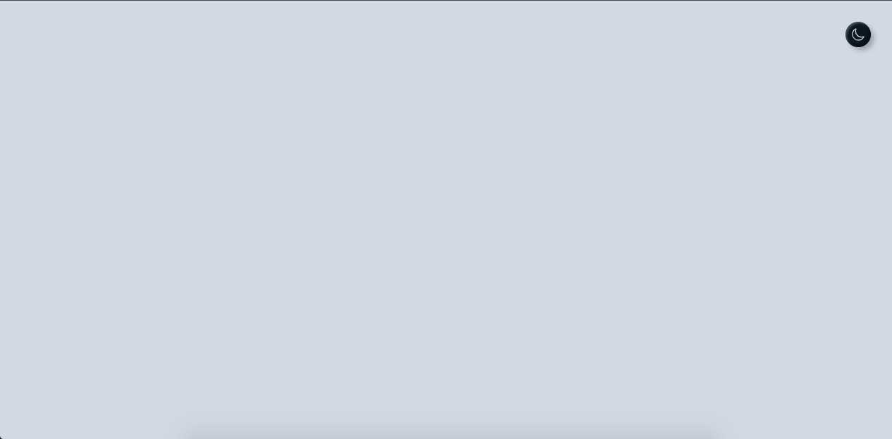

## switch-mode-button
you can customize it by whatever, wherever, and whenever you want

# Preview
### [See Live](https://daudhiyaa.github.io/switchmode-button/)
- Dark Mode:
</img>
  
- Light Mode:
</img>